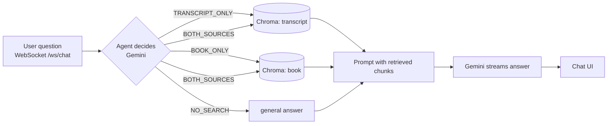

# Flu Akademi Ders Asistanı — RAG course assistant

[](https://github.com/mehmetarifkuzgun/flu-akademi-chatbot/actions/workflows/ci.yml)

A Turkish-language chatbot that answers questions about a lecture (the Neolithic Revolution) using two
sources: the **lecture transcript** and a **book chapter**. A Gemini-based agent first decides *which
source to search* (or none), retrieves the closest passages from a Chroma vector store, and streams a
grounded answer to a web chat over WebSocket.

*([Türkçe README](README.tr.md))*


> **About the screenshots.** They come from the real app running in **offline demo mode**
> (`CHATBOT_OFFLINE=1`) on the small original texts in `sample_data/`, not on the real course material.
> Retrieval (Chroma) and the whole request path are real, but the answer is assembled from the retrieved
> sentences by a deterministic `ScriptedModel` (`offline.py`) — **not by Gemini** — and the UI and the answer
> both say so. The Gemini path itself was **not run** while preparing this README (no API key in the build
> environment); it is the original code path.

## How it works



- `main.py` — `AgenticDemoChatbot`: loads the two text files, chunks them (1000 chars, 200 overlap), embeds
  them and registers the two search tools.
- `gemini_chatbot.py` — the agent: decision prompt → tool execution → final (streamed) prompt.
- `embedding_generator.py` (Google `embedding-001`), `vector_database.py` (Chroma, cosine), `text_processor.py`.
- `api/index.py` — FastAPI app: static chat UI, `/health`, `/ws/chat` (message types `bot_thinking`, `bot_start`,
  `bot_chunk`, `bot_complete`, `error`). Deployed on Render (`render.yaml`, `DEPLOYMENT.md`).

## Run it

**Without any API key (offline demo, also what CI runs):**
```bash
pip install -r requirements.txt
CHATBOT_OFFLINE=1 TRANSCRIPT_FILE=sample_data/transcript.txt BOOK_FILE=sample_data/book.txt \
  python api/index.py            # open http://127.0.0.1:8000
```

**With Gemini:**
```bash
cp .env.example .env             # set GOOGLE_API_KEY
python api/index.py              # web UI;   python main.py  for a terminal chat
```
Put your own texts in `transcript.txt` / `kitap.txt` (or point `TRANSCRIPT_FILE` / `BOOK_FILE` elsewhere).

## Tests

```bash
pip install -r requirements.txt pytest "httpx<0.28"
pytest -q        # 26 tests, ~4 s, no network
```
Chunking, offline embeddings, Chroma round-trip, tool routing, the "don't re-embed unchanged files" cache,
and the WebSocket protocol end to end (streaming, invalid JSON, too-long message, rate limit, error handling).
`python scripts/capture_screenshots.py` regenerates the screenshots.

## Limitations

- Uses the deprecated `google-generativeai` SDK (pinned `0.8.5`); migrating to `google-genai` is the next step.
- Bot replies are rendered with `marked` into `innerHTML` without sanitising; add DOMPurify before exposing it to
  untrusted content.
- No conversation memory: each question is answered independently. Rate limiting is per connection, not per IP.
- Retrieval quality and answer quality with Gemini were not evaluated here.
- The bundled `kitap.txt` / `transcript.txt` are third-party material (see below); the repo's code licence does
  not cover them.

## Content notice

`transcript.txt` is a transcript of a Flu Akademi lecture and `kitap.txt` is a translated book chapter. Their
rights belong to their respective authors/publishers; only use them with permission. `sample_data/` contains
original texts written for demos and tests.
