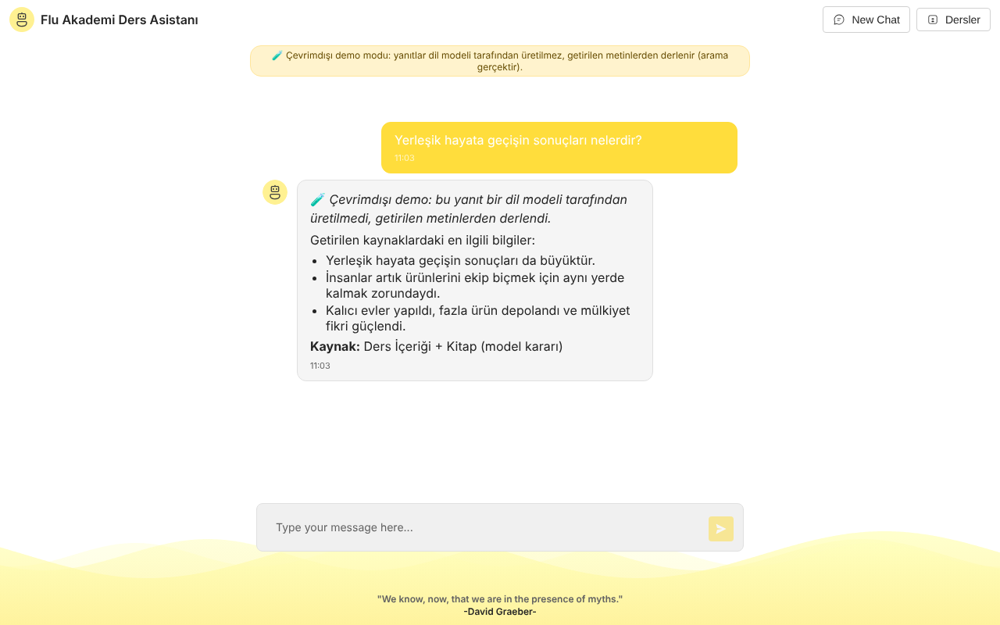

# Flu Akademi Ders Asistanı — RAG tabanlı ders chatbot'u

Bir dersi (Neolitik Devrim) iki kaynaktan yanıtlayan Türkçe chatbot: **ders transkripti** ve **kitap bölümü**.
Gemini tabanlı bir ajan önce *hangi kaynakta arama yapacağına* (ya da hiç aramayacağına) karar verir, Chroma vektör
veritabanından en yakın parçaları getirir ve cevabı WebSocket üzerinden akıtarak sohbet arayüzüne gönderir.



> **Ekran görüntüleri hakkında.** Gerçek uygulamanın **çevrimdışı demo modunda** (`CHATBOT_OFFLINE=1`),
> `sample_data/` içindeki küçük özgün metinlerle çalışırken alındı; gerçek ders materyali kullanılmadı. Chroma araması
> ve tüm istek yolu gerçektir, ancak yanıt Gemini ile **değil**, getirilen cümlelerden deterministik bir
> `ScriptedModel` (`offline.py`) ile derlenir; arayüz ve yanıt bunu açıkça belirtir. Gemini yolu bu README
> hazırlanırken **çalıştırılmadı** (API anahtarı yoktu).

## Çalıştırma

**API anahtarı olmadan (çevrimdışı demo; CI de bunu çalıştırır):**
```bash
pip install -r requirements.txt
CHATBOT_OFFLINE=1 TRANSCRIPT_FILE=sample_data/transcript.txt BOOK_FILE=sample_data/book.txt python api/index.py
```
**Gemini ile:** `cp .env.example .env` → `GOOGLE_API_KEY` ayarla → `python api/index.py` (terminal sohbeti: `python main.py`).

**Testler:** `pip install -r requirements.txt pytest "httpx<0.28" && pytest -q` (26 test, ağ gerekmez).

## Sınırlamalar ve içerik notu

Kullanımdan kalkmış `google-generativeai` SDK'sı kullanılıyor; konuşma hafızası yok; bot yanıtları `innerHTML`'e
temizlenmeden basılıyor (güvenilmeyen içerik için DOMPurify ekle). `transcript.txt` bir Flu Akademi dersinin
transkripti, `kitap.txt` çevrilmiş bir kitap bölümüdür; hakları ilgili yazar/yayıncılara aittir, yalnızca izinle
kullanın. `sample_data/` demo ve testler için yazılmış özgün metinlerdir.
